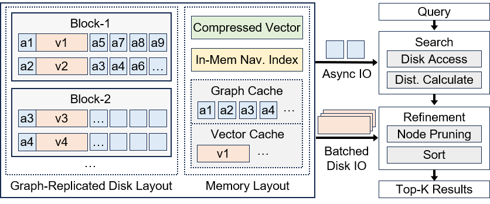

# Gorgeous: High-Performance Disk-Based Vector Search

Gorgeous is a high-performance disk-based Approximate Nearest Neighbor Search (ANNS) system designed to efficiently handle large-scale high-dimensional vector datasets. This implementation is based on the research paper *Revisiting the Data Layout for Disk-based High-Dimensional Vector Search*.

> **Note:** If you're using DiskANN for high-dimensional vector search in AI workloads, try Gorgeous for significant performance improvements!

## 🚀 Quick Start

### Prerequisites

Install system dependencies:

```bash
apt install build-essential libboost-all-dev make cmake g++ libaio-dev libgoogle-perftools-dev clang-format libmkl-full-dev
```

### Build oneTBB Library

```bash
cd graph_partition
git clone https://github.com/uxlfoundation/oneTBB.git
cd oneTBB
cmake --build .
```

### Running Benchmarks

1. Navigate to the `scripts` directory
2. Modify dataset paths in `config_dataset.sh`
3. Run the benchmark:

```bash
bash run_benchmark.sh [debug/release] [build/build_mem/gp/split_graph/gr_layout/search]
```

#### Command Arguments

| Argument | Description |
|----------|-------------|
| `debug/release` | Build mode to run (passed to CMake) |
| `build` | Build the index |
| `build_mem` | Build memory index |
| `gp` | Graph partition given index file |
| `split_graph` | Generate Graph Index only file |
| `gr_layout` | Generate Graph-Replicated Storage Layout |
| `search` | Search the index |

### Configuration

Configure datasets and parameters in `config_local.sh`.

For detailed parameter descriptions and execution flows, see [scripts/README.md](scripts/README.md).

## 🏗️ Architecture & Design

<p align="center">
  
</p>

### Key Innovation

Traditional systems like DiskANN and Starling treat the index graph and full vectors equally, storing them together. Gorgeous recognizes the access inequality between these components and prioritizes the index graph over full vectors, significantly reducing disk access overhead and improving search efficiency.

### Core Techniques

- **Graph Priority Memory Cache:** Prioritizes graph caching over exact vector storage
- **Graph Replicated Disk Layout:** Replicate adjacency lists (the index graph) in disk pages instead of padding
- **Asynchronous Block Prefetch:** Prefetches disk blocks to reduce access latency
- **Tiny In-Memory Navigation Graph:** Uses a compact (0.5%) memory index for entry point discovery
- **Flexible Memory Configuration:** Adapts to various memory ratios with improved search efficiency at higher ratios

## 📊 Performance Comparison

Gorgeous outperforms other disk-based systems ([DiskANN](https://github.com/microsoft/DiskANN) and [Starling](https://github.com/zilliztech/starling)) under identical conditions (20% memory ratio, same CPU threads) on four 100-Million datasets:

<p align="center">
  
</p>

## 🔬 Research Paper

If you find Gorgeous useful in your research, please cite:

**[Gorgeous: Revisiting the Data Layout for Disk-Resident High-Dimensional Vector Search]()**

```bibtex
```


## 📄 License

MIT License - see [LICENSE](LICENSE) for details.
